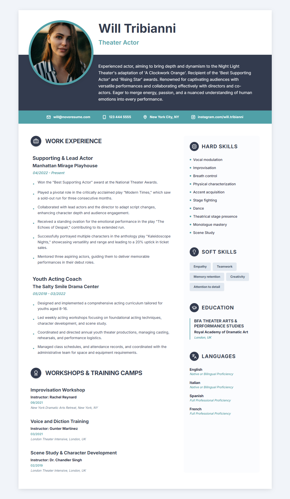

# 🚀 Resume_template_with_React+Tailwindcss - Modern React Resume Template

Resume_template_with_React+Tailwindcss is a premium, high-performance resume template built with **React 19**, **TailwindCSS**, and **Framer Motion**. It features a modern "Hybrid" layout that combines traditional text-heavy professional info with sleek, modern visual elements.



## ✨ Features

- **🎨 Premium Design**: Modern, clean, and professional "Hybrid" resume layout.
- **📱 Fully Responsive**: Looks stunning on desktops, tablets, and mobile devices.
- **⚡ Ultra Fast**: Built with Vite for near-instant development and optimized production builds.
- **🎭 Smooth Animations**: Elegant entrance and hover animations powered by Framer Motion.
- **📑 Data-Driven**: Entirely customizable via a central `resumeData.ts` file—no need to touch complex UI code!
- **🖨️ Print Optimized**: Specifically styled to look perfect when exported to PDF or printed.
- **🧩 Modern Tech Stack**: React 19, TypeScript, TailwindCSS, Lucide Icons.

## 🛠️ Tech Stack

- **Framework**: [React 19](https://react.dev/)
- **Bundler**: [Vite 8](https://vitejs.dev/)
- **Styling**: [TailwindCSS 3](https://tailwindcss.com/)
- **Animations**: [Framer Motion](https://www.framer.com/motion/)
- **Icons**: [Lucide React](https://lucide.dev/)
- **Language**: [TypeScript](https://www.typescriptlang.org/)

## 🚀 Getting Started

### Prerequisites

- [Node.js](https://nodejs.org/) (v18.0.0 or higher)
- [npm](https://www.npmjs.com/) or [yarn](https://yarnpkg.com/)

### Installation

1. **Clone the repository**
   ```bash
   git clone https://github.com/Rakesh01999/resume_template_with_react-tailwindcss.git
   cd resume_template_with_react-tailwindcss
   ```

2. **Install dependencies**
   ```bash
   npm install
   ```

3. **Start the development server**
   ```bash
   npm run dev
   ```

## 📝 Customization

Customizing your resume is incredibly easy! All you need to do is update the `src/resumeData.ts` file with your details.

```typescript
// src/resumeData.ts
export const resumeData = {
  personalInfo: {
    name: "Your Name",
    role: "Your Profession",
    // ... add your details
  },
  // ... rest of your data
};
```

## 📜 Scripts

| Command | Description |
| :--- | :--- |
| `npm run dev` | Starts the development server at `localhost:5173` |
| `npm run build` | Builds the project for production |
| `npm run preview` | Previews the production build locally |
| `npm run lint` | Runs ESLint to check for code quality issues |

## 🤝 Contributing

Contributions are welcome! Feel free to open issues or submit pull requests to improve the template.

## 📄 License

This project is open source and available under the MIT License.

---

Developed with ❤️ by [Rakesh](https://github.com/Rakesh01999)
